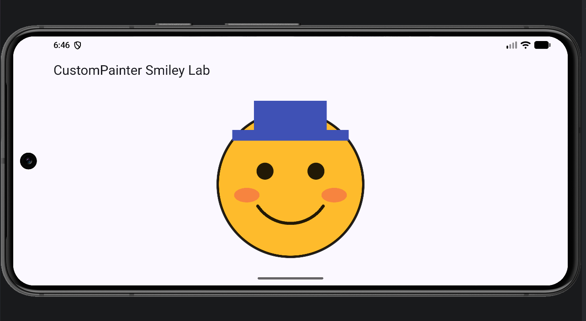

# Critical Thinking Answer

**Student:** Ernest Fistik

I centered the face at `Offset(size.width / 2, size.height / 2)` with radius `size.shortestSide * 0.4`, and built the mouth with `drawArc` between fixed endpoints at `c.dy + 0.3r` and `±0.45r`; at mood 0.8 the start angle is about 0.19π and the sweep about 0.62π. Since every mouth value is a fraction of `r` instead of fixed pixels, the smile stays centered and scales with the face. In landscape on the emulator, the face stayed a full circle with the mouth centered and no overflow stripes; the face filled most of the screen height, so I wrapped the controls in a `SingleChildScrollView` so the sliders can be reached by scrolling. `shouldRepaint` returns true when mood changes so Flutter redraws the new mouth, and false when inputs are unchanged so it skips unnecessary redraws.

